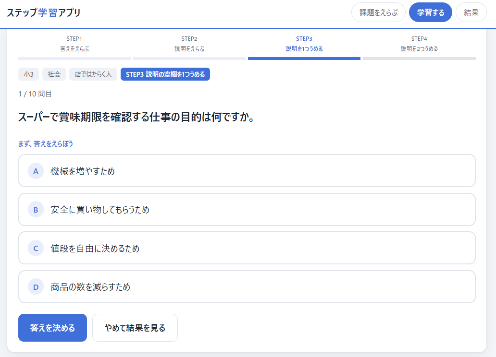
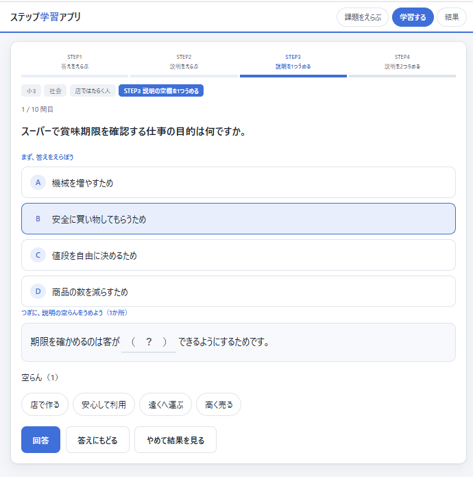
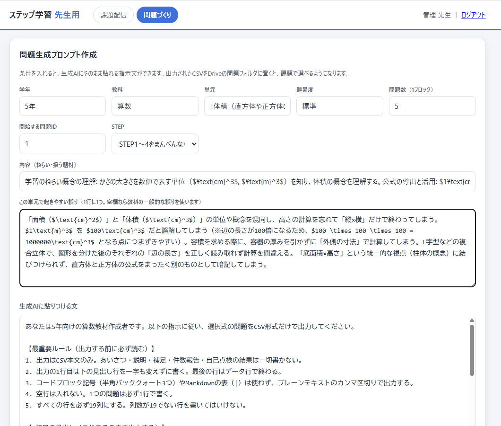
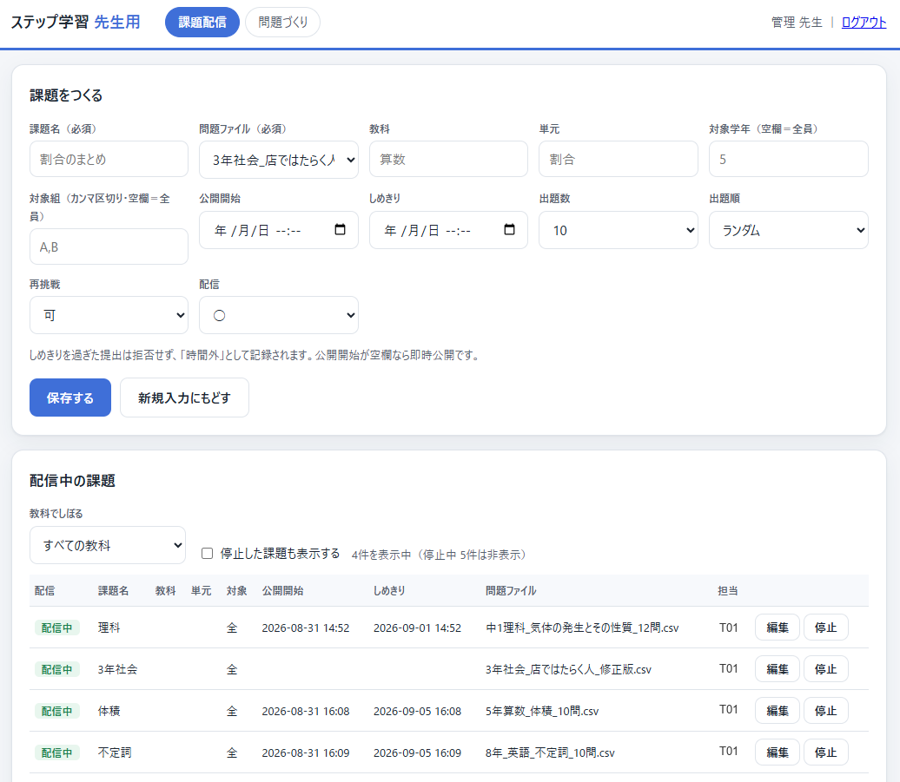
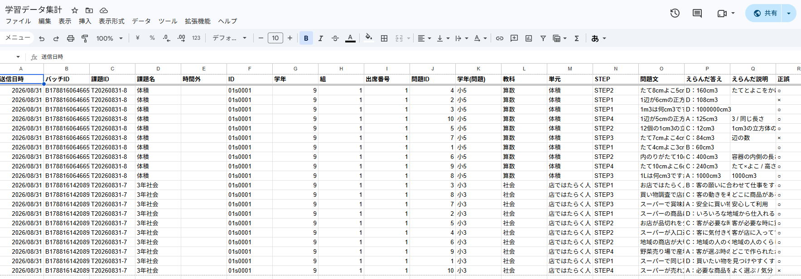

# ステップ学習アプリ

児童生徒が「答え」だけでなく **その答えになる理由** を段階的に選び取る、選択式の学習アプリです。
Google Workspace for Education の範囲内（Google Apps Script ＋ スプレッドシート）で動作し、追加費用はかかりません。

- 対象：小学校3年〜中学校3年（学年・組単位で課題を配信）
- 出題構造：「答え → 理由の説明」を4段階（STEP1〜4）に分解
- 個人情報：**氏名をクラウドに保存しません**。ID と氏名の突合は教員端末の中だけで行います
- 依存：なし。外部ライブラリもCDNも使いません（SHA-256も自前実装）

## 画面

### 児童生徒の画面（STEP3の例）

まず、答えを4択から選びます。

答えを選ぶと、**その理由を説明する文**が現れ、空欄（１）を4択から埋めます。
上部のSTEP1〜4のバーが、いま何を求められているかを示します。
**このアプリの核心はこの画面です。**

### 教員の画面

学年・教科・単元・難易度・**この単元で起きやすい誤り**を入れると、
生成AIにそのまま貼れる作問プロンプトができます。出力されたCSVをDriveに置くと課題で選べます。

課題名・問題ファイル・対象学年・対象組・公開開始・しめきり・出題数・出題順・再挑戦を指定して配信します。
しめきりを過ぎた提出は拒否せず、「時間外」として記録されます。

### 記録されるデータ

回答シートに入るのは ID・学年・組・出席番号だけです。**氏名の列が存在しないことが確認できます。**
氏名が必要な集計は、`roster.html` で教員端末の中だけで突き合わせます。

## 👉 このリポジトリの使い方

**完成品を配るためではなく、生成AIと壁打ちしながら自分の学校版を作り直すために公開しています。**

コードをそのまま使っても構いませんが、作り直したほうが自分で直せるものになります。
そのための指示文・設計仕様・落とし穴を1つのドキュメントにまとめました。

### ▶ [**07_生成AIと作り直す手順.md**](07_生成AIと作り直す手順.md) — ここから読んでください

プログラミングの知識は不要です。必要なのは「作りたいものを日本語で説明できること」と、
出てきたものを開いて動かし、違っていたら言葉で伝え直すことです。

| 中身 | 内容 |
|---|---|
| 全体の流れ | 5ブロックに分けて1つずつ完成させる進め方 |
| 設計の芯 | 崩すと別物になる5つの判断 |
| そのまま貼れる指示文 | 児童生徒画面 / サーバー / 教員画面 / 名簿照合ツール |
| データ仕様 | 19列の問題CSV、4シートの構成 |
| 通信方式 | `no-cors` POST ＋ JSONP という、AIが必ず間違えるところ |
| つまずきポイント集 | 実際に作って分かった落とし穴と対処 |
| 動作確認チェックリスト | ここまで通れば授業で使える |

問題を作らせる指示文だけを見たい場合は [**08_作問プロンプト.md**](08_作問プロンプト.md) にあります。

**ブロック1と2（児童生徒画面＋問題データ）だけで授業では使えます。**
クラウド集約は、それが必要になってから足してください。

## STEP構造

| STEP | 児童生徒の操作 | ねらい |
|---|---|---|
| 1 | 答えを4択から選ぶ | 知識・理解の確認 |
| 2 | 答えを選び、**その理由の説明文**を4択から選ぶ | 説明を選び取る |
| 3 | 答えを選び、説明文の**空欄（１）**を4択から埋める | 説明を組み立てる |
| 4 | 答えを選び、説明文の**空欄（１）（２）**を4択から埋める | 説明を最後まで組み立てる |

答えと空欄がすべて正解のときだけ「正解」とします。部分正解は「2/3か所」の形で記録に残ります。

問題は生成AIに作らせ、**教員は方向性の決定と点検に専念します。**
`teacher.html` には、条件を入れると作問プロンプトを組み立てる機能が入っています。
その指示文の全文は [`08_作問プロンプト.md`](08_作問プロンプト.md) にあります。

## ファイル構成

| ファイル | 配布先 | 役割 |
|---|---|---|
| `index.html` | 児童生徒 | ログイン → 課題をえらぶ → 学習 → 送信 |
| `teacher.html` | 先生のみ | 課題の作成・編集・配信停止、問題生成プロンプトの作成 |
| `roster.html` | 先生のみ | ID→氏名の突合と集計（**通信しません**。端末内で完結） |
| `コード.gs` | Apps Script | サーバー側処理（認証・回答保存・課題配信） |
| `サンプル問題.csv` | — | 19列CSVのサンプル（形式の参考用） |

## ドキュメント

| ファイル | 内容 |
|---|---|
| [`07_生成AIと作り直す手順.md`](07_生成AIと作り直す手順.md) | **作り直すための指示文・仕様・落とし穴** |
| [`08_作問プロンプト.md`](08_作問プロンプト.md) | **問題を作らせる指示文の全文**とテンプレート、点検の観点 |
| [`00_企画書.md`](00_企画書.md) | 導入企画書（教育委員会・管理職向け）。設計の根拠と限界 |
| [`01_利用マニュアル.md`](01_利用マニュアル.md) | 利用マニュアル、問題CSVの仕様 |
| [`03_配布手順.md`](03_配布手順.md) | 児童生徒・教員へのファイル配布手順 |
| [`04_スプレッドシート連携手順.md`](04_スプレッドシート連携手順.md) | スプレッドシート連携とデプロイ設定 |
| [`05_課題配信の運用.md`](05_課題配信の運用.md) | 複数の先生・複数教科での課題配信の運用 |
| [`06_名前照合ツール.md`](06_名前照合ツール.md) | 名前照合ツールの使い方 |
| [`別紙1_構築手順書.md`](別紙1_構築手順書.md) | 構築手順書（情報担当用）。ゼロから立ち上げる場合 |

## そのまま動かす場合の設定

**設定値はすべて空で公開しています。** 空のままだと「設定してください」と表示され、動きません。
使う前に次の4か所を自分の環境の値に入れてください。

| ファイル | 変数 | 設定する値 |
|---|---|---|
| `index.html` / `teacher.html` | `SEND_URL` | 自分でデプロイしたウェブアプリのURL |
| `index.html` / `teacher.html` | `SEND_TOKEN` | 自分で決めた合言葉 |
| `コード.gs` | `TOKEN` | `SEND_TOKEN` と同じ値 |
| `コード.gs` | `SECRET` | 長くランダムな文字列（自分で生成する） |
| `コード.gs` | `QUESTION_FOLDER_ID` | 問題CSVを置くDriveフォルダのID |

手順は [`04_スプレッドシート連携手順.md`](04_スプレッドシート連携手順.md) と
[`別紙1_構築手順書.md`](別紙1_構築手順書.md) にあります。

> ⚠️ **設定値を書き込んだファイルを公開リポジトリにコミットしないでください。**
> とくに `SECRET` が漏れると、ログイン券を偽造され、他人のIDで提出できるようになります。

## このアプリで守れないこと

セキュリティを過大に主張しないために明記します。

- `index.html` は児童生徒の端末にあるため、コードを開けばログイン処理は迂回できます。**学習内容の保護にはなりません**
- URLと合言葉はファイルを開けば読めます。**校外への配布は不可**です
- 守れるのは「**他人のIDで結果を提出すること**」までです。目的は集計の正しさの担保です

詳細は [`00_企画書.md`](00_企画書.md) の「8. 個人情報保護とセキュリティ」を参照してください。

## 限界（設計上の割り切り）

**このアプリは、自分の言葉で説明を書けるようになるための踏み台であり、それ自体が到達点ではありません。**

- 正しい説明を**選べる**ことと、自分で**書ける**ことは同じではありません
- 4つの選択肢を見た時点で、考えるべき観点が提示されてしまいます
- 誤答の質が低いと、消去法で解けてしまいます

STEP4まで解けたあとに、ノートへ自分の言葉で書かせる運用を前提にしてください。

## ライセンス

自由に複製・改変・再配布してかまいません。ご自身の学校・自治体の状況に合わせて作り直してください。
無保証です。導入の判断と個人情報の取り扱いは、各設置者の責任で行ってください。
